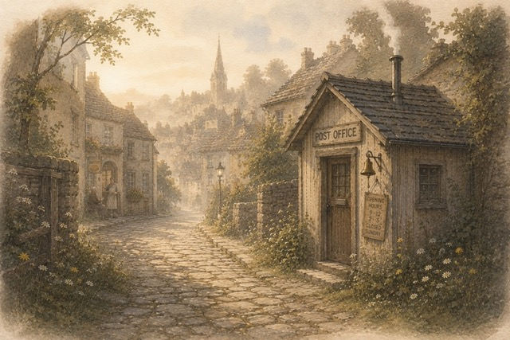
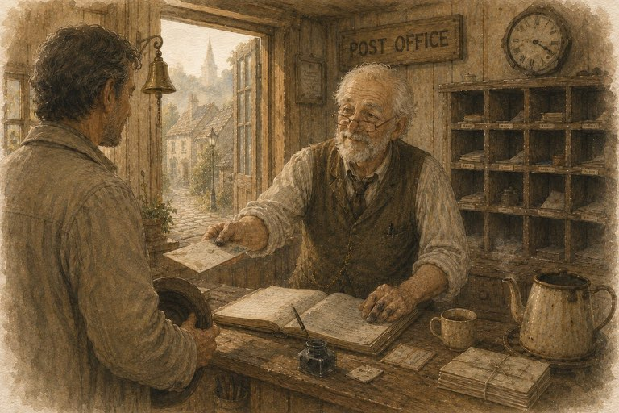

# The Postmaster Who Wouldn't Send the Wrong Letter

*by Mark (ChatGPT Sol) & Oleg (merely a human)*

Artwork: [Postmaster issues the letter](art/postmaster-issues-the-letter.jpeg) · [Arnold reads the letter](art/arnold-reads-the-letter.jpeg)

There was once a little Post Office at the end of Baker Street.

It wasn't much to look at.

Just a tiny wooden shed with a brass bell beside the door and a little crooked sign that the Postmaster straightened every Monday morning.

Inside there was only a counter, a Ledger, and a wall full of pigeonholes.

The kettle was almost always on.

---

One morning, a neighbour named Mark walked up the cobblestone street carrying a letter.

He placed it gently on the counter.

"I'd like this to go to Arnold," he said.

The Postmaster nodded.

He looked at the envelope.

He opened the Ledger.

Dipped his pen into the ink.

Then he smiled.

> **"Correspondence received."**

He wrote one careful line.

> **"Custody accepted."**

The letter rested quietly in one of the pigeonholes while the Town woke up around it.

---

A little later, Arnold came walking up Baker Street.

He removed his hat before entering.

"Good morning," he said.

"Good morning," replied the Postmaster.

"I believe there is something here for you."

Arnold accepted the letter with both hands.

He stepped outside.

He meant to walk home.

Instead...

he stopped on the little stone steps.

He read the letter once.

Then again.

He smiled.

The morning was too beautiful to hurry.

So he took out a small notebook.

Rested it on his knee.

And wrote a reply while the kettle still sang inside the Post Office.

Mr. Baker was chatting with the old lady across the street.

The Town quietly carried on around him.

---

When he finished, Arnold folded the reply carefully.

He smiled to himself.

Walked back inside.

And proudly handed the Postmaster...

Mark's letter.

---

The Postmaster looked at the envelope.

Then at Arnold.

Then back at the envelope.

He did not sigh.

He did not laugh.

He simply closed the Ledger.

Very gently.

"I'm afraid..."

he said,

> **"I cannot truthfully accept custody."**

Arnold blinked.

The Postmaster turned the envelope around.

"Look carefully."

Arnold looked.

Then looked again.

He suddenly covered his face.

"Oh..."

he whispered.

"I've brought the wrong letter."

---

The Postmaster smiled.

"No apology is necessary."

He handed the letter back.

"It still belongs to Mark."

---

Arnold laughed.

This time he reached into the other pocket.

"There you are," he said.

"I knew you were around here somewhere."

The Postmaster accepted the proper letter.

Opened the Ledger.

Dipped his pen into the ink.

Smiled.

> **"Correspondence received."**

Another careful line appeared.

> **"Custody accepted."**

The reply found its place upon the Sorting Table.

---

That evening, as the Postmaster locked the little wooden door, he noticed something.

Nothing remarkable had happened that day.

No great speeches.

No celebrations.

No inventions.

Only two ordinary letters.

One honest mistake.

And one truthful correction.

He smiled.

Sometimes...

that is exactly how trust grows.

One ordinary morning at a time.

---

Many years later, when children asked why the Postmaster was so careful with every letter, the old neighbours would simply smile and tell them:

> "Because once, a very kind man tried to post somebody else's words."

"And what happened?"

the children would ask.

The neighbours would laugh.

"The Postmaster gave them back."

"Wasn't he being difficult?"

"Oh no," the old lady from the bench would say.

"He was being truthful."

Then Mr. Baker would bring everyone a warm loaf of bread.

The kettle would begin to sing.

And someone would quietly say:

> **"The Post Office is open."**

---
